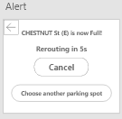
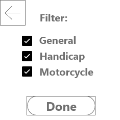

## Phase 2: User-Centric Design

## Executive Summary:

  - Investigated user experience to accommodate those with particular circumstances 
  
    - Examples likeusing a filter for handicap, motorcycles, and general parking
    
      - Gave users the option to pin their favorite locations
      
    - Added a crowd meter to have a general understanding of how times might impact the user 
    
  - Accomodate the personas in specific scenarios to represent our users
  
    - It gave the user several options to choose between different locations and had a high error tolerance for miss clicking a location or being packed on the drive there.
    
    - Put in a chime that will automatically change the route once the parking lot is full, and this is for the user's safety
    
      - The alert can be canceled with a single click, similar to Google Maps
      
  - Made all wireframes interaction friendly 
  
    - All boxes or labels will lead to another wireframe
    
    - It is made to be as identical to an app as possible 
    
      - The app has a simple menu was included for the user to change their account information or modify the setting
      
        - Allowed the user to give back feedback  about their experience
        
## Wireframe Artboards

For this second phase, we designed a wireframe and prototype to best match the data we collected in phase one. The data collected was all from CSU students and this solution is catered to their needs. We wanted to create a live application that provides real time information to the user, whether they're commuting 30+ minutes or live within walking distance of campus.

To begin, we created a simple login/signin page that uses the student account that all CSU students already use. This eliminates any extra steps taken or possible mistakes that arise from having to create a new account and remember any new username/passwords. Forgot username and forgot passwords will be the same steps students have experience with.

After Sign in we start with basic important information listed top to bottom for the user. Beginning with a large counter of total available parking spots, the user will have an idea of the live traffic, followed by a visual map for the user to zoom in and out, and tap to make a parking lot destination location. Under the map, we demonstrate a crowd meter. This is a chart similar to google traffic to demonstrate the activity of traffic. Underneath the crowd meter we have the entire list of spots at the CSU campus for users who like lists. Within The list, users have the ability to pin their favorite spots to the top in order to save them for later visits. (similar to pinning posts on twitter). The list offers the user a live update of available spots in each parking spot.

  

The user can tap a location on the map, or tap a location on the list. After making their selection, the student is prompted to confirm directions and is redirected to their google maps or imaps. While navigating to their destination, the user will update if the destination becomes full and no longer available, the user receives a pop up alert with audio stating the automatic reroute to closest destination. The user does nothing to reroute in order to ensure traffic safety, but the user has the option to cancel. This is a neat feature in the case that a student is commuting from out of town and wants to park ASAP. 

 

Students have the ability to sort their destination parking lots by availability or popularity. We made this a key function seeing as most if not all of the students we collected data from just wanted to find parking ASAP. Finding the best available spot is the default sort method but can be changed to sorting by popularity or traffic of parking locations. This is for the rare cases where students have a bit more time to maybe go to the least popular parking lot(s) in hopes of finding the parking spot nobody else goes to. They can also filter parking by 3 categories: General, handicap and motorcycle. This accommodates motorcyclists and any handicap students.

   

The user has basic settings to access and edit account information, logout, enable/disable notifications and GPS, and submit feedback. This will allow the user to limit distractions if they do not want alerts while driving. The feedback submission will allow us to build on the personas we currently have and provide the user with a better experience as we continue development. 

## Supplementary Materials

  * [Our Wireframe Prototype Link](https://xd.adobe.com/view/ceb98465-76ee-499e-91b5-50ee09582c67-9bea/) Draft

  * [Our Wireframe Artboards](https://github.com/UsabilityEngineering/Parkers/blob/master/phase2/newfolder/Wireframe%20Artboard.pdf)
